# Database ER Diagram & Reference Manual (Optimized Schema Design)

This document contains a visual Entity Relationship (ER) Diagram (using **Mermaid.js**) and a complete schema specification for the database of the portfolio application, structured via **Mongoose** with optimized architecture improvements.

It addresses all architectural gaps by incorporating stricter types (converting formatted date strings to `date`), establishing formal `ObjectId` foreign key references instead of loose strings, enforcing singletons, drawing explicit administrative audit trails/user relations, and improving data model hygiene.

---

## 1. Visual Entity Relationship (ER) Diagram

Below is the conceptual ER diagram representing all **15 active collections** and their strict physical/logical relationships.

> **Removed Collections (2026-06-02):** `Testimonial`, `Service`, `Workflow`, and `Stat` were removed to align with a minimal developer portfolio aesthetic inspired by brittanychiang.com. The Mongoose model files may still exist but are no longer referenced by the application.

```mermaid
erDiagram
    %% Core Entities
    USER {
        ObjectId _id PK
        string email "Unique"
        string passwordHash "Select: false"
        string name "Default: Admin"
        string resetPasswordToken "Select: false"
        string resetPasswordOtp "Select: false"
        date resetPasswordExpire "Select: false"
        date createdAt
        date updatedAt
    }

    PROJECT {
        ObjectId _id PK
        string title
        string slug "Unique"
        string description
        string image "Optional"
        ObjectId_array categoryIds "FK to Category._id"
        ObjectId_array skillIds "FK to Skill._id"
        object_array github
        object_array live
        boolean featured "Default: false"
        string_array improvements
        object_array media
        number order "Default: 0"
        date createdAt
        date updatedAt
    }

    CATEGORY {
        ObjectId _id PK
        string name
        string slug "Unique"
        number order "Default: 0"
        date createdAt
        date updatedAt
    }

    SKILL {
        ObjectId _id PK
        string name
        string tech "Optional"
        number level "0-100, Default: 80"
        string iconName "Optional"
        number order "Default: 0"
        date createdAt
        date updatedAt
    }

    EXPERIENCE {
        ObjectId _id PK
        string title
        string org
        date startDate
        date endDate "Nullable - null means current"
        string_array details
        number order "Default: 0"
        string url "Optional"
        string_array previousTitles
        object_array links
        ObjectId_array skillIds "FK to Skill._id"
        date createdAt
        date updatedAt
    }

    DEMO {
        ObjectId _id PK
        string title
        string description
        string url
        ObjectId_array skillIds "FK to Skill._id"
        object_array media
        number order "Default: 0"
        date createdAt
        date updatedAt
    }

    BLOG {
        ObjectId _id PK
        string title
        string description
        string link
        date date
        string_array tags "Optional - free-form, not FK"
        string image "Optional"
        number order "Default: 0"
        date createdAt
        date updatedAt
    }

    CERTIFICATION {
        ObjectId _id PK
        string title
        string issuer
        date issuedAt
        date expiresAt "Optional"
        string link "Optional"
        string image "Optional"
        string_array details
        number order "Default: 0"
        date createdAt
        date updatedAt
    }

    EDUCATION {
        ObjectId _id PK
        string degree
        string institution
        string location "Optional"
        string logo "Optional"
        date startDate
        date endDate "Nullable - null means current"
        string gpa "Optional - allows 3.8/4.0 format"
        string_array details
        string link "Optional"
        number order "Default: 0"
        date createdAt
        date updatedAt
    }

    %% Single-Document / Page Configuration Entities
    HERO {
        ObjectId _id PK "Singleton - fixed _id"
        string name
        string lastName
        string profileImage
        string resumeUrl
        string bio "Default: empty"
        object_array typeSequences
        date createdAt
        date updatedAt
    }

    ABOUT {
        ObjectId _id PK "Singleton - fixed _id"
        string title "Default: About me"
        string aboutBio
        string_array highlights
        date createdAt
        date updatedAt
    }

    SETTING {
        ObjectId _id PK "Singleton - fixed _id"
        string siteName "Default: Portfolio"
        string siteDescription "Default: A professional portfolio"
        string_array keywords
        string contactEmail "Optional"
        string contactPhone "Optional"
        string contactLocation "Optional"
        string ogImage "Optional"
        boolean isHireable "Default: true"
        boolean maintenanceMode "Default: false"
        string accentColor "Default: emerald"
        date createdAt
        date updatedAt
    }

    %% Interactive & Utility Entities
    MESSAGE {
        ObjectId _id PK
        string name
        string email
        string message
        string status "unread | read, Default: unread"
        ObjectId readBy "FK to User._id, Optional"
        date createdAt
        date updatedAt
    }

    VISITOR {
        ObjectId _id PK
        date date "Unique"
        number count "Default: 0"
        date createdAt
        date updatedAt
    }

    SOCIALLINK {
        ObjectId _id PK
        string platform
        string href
        string label "Default: platform name"
        number order "Default: 0"
        date createdAt
        date updatedAt
    }

    %% Conceptual and Physical Relationships
    PROJECT }o--o{ CATEGORY : "references via categoryIds"
    PROJECT }o--o{ SKILL : "references via skillIds"
    EXPERIENCE }o--o{ SKILL : "references via skillIds"
    DEMO }o--o{ SKILL : "references via skillIds"
    MESSAGE }o--o| USER : "read/processed by readBy"
```

---

## 2. Refined Schema Specifications

### 2.1 Core Content Collections

#### 1. Project (`projects`)

Detailed metadata representing custom software projects.

- **Fields:**
  - `_id` (ObjectId, PK): Unique document identifier.
  - `title` (String, required): Name of the project.
  - `slug` (String, required, unique): Custom slug for URL path.
  - `description` (String, required): Long text detailing the project.
  - `image` (String, optional): Main teaser/preview image.
  - `categoryIds` (Array of ObjectIds): Physical FK pointing to `Category._id`.
  - `skillIds` (Array of ObjectIds): Physical FK pointing to `Skill._id` (replaces loose `techNames`).
  - `github` (Array of Objects): Source control repository configurations.
    - `label` (String, default: `"Repository"`): Display tag.
    - `url` (String, required): Git URL link.
  - `live` (Array of Objects): Deployed link configurations.
    - `label` (String, default: `"Live Demo"`): Display tag.
    - `url` (String, required): Active deployment URL link.
  - `featured` (Boolean, default: `false`): Highlights project on main landing showcases.
  - `improvements` (Array of Strings): Planned iterations or feature rollouts.
  - `media` (Array of Objects): Showcase assets block.
    - `type` (String, enum: `["image", "video", "embed"]`, default: `"image"`): Asset kind.
    - `url` (String, required): Media asset path/URL.
    - `caption` (String, optional): Explanation text overlay.
    - `thumbnail` (String, optional): Lazyload placeholder.
  - `order` (Number, default: `0`): UI arrangement order.
  - `createdAt` / `updatedAt` (Date, auto): Timestamps.

#### 2. Category (`categories`)

Groups and filters portfolio items.

- **Fields:**
  - `_id` (ObjectId, PK): Unique identifier.
  - `name` (String, required): Readable label (e.g. "Full-Stack Development").
  - `slug` (String, required, unique): Router handle.
  - `order` (Number, default: `0`): Render ranking.

#### 3. Skill (`skills`)

Competency elements represented visually using charts/level meters. Replaces the redundant static `TECH` collection by unifying all stack and technology references.

- **Fields:**
  - `_id` (ObjectId, PK): Unique identifier.
  - `name` (String, required): Label of the skill (e.g. "Next.js").
  - `tech` (String, optional): Tech group classification (e.g. "Frontend", "Database").
  - `level` (Number, default: `80`, min: `0`, max: `100`): Proficiency percentage.
  - `iconName` (String, optional): Associated Lucide/React icon reference.
  - `order` (Number, default: `0`): Drag order index.

#### 4. Experience (`experiences`)

Timeline detailing job history and roles.

- **Fields:**
  - `_id` (ObjectId, PK): Unique identifier.
  - `title` (String, required): Job title.
  - `org` (String, required): Employing organization.
  - `startDate` (Date, required): Job commencement date (replaces free-form `duration` string).
  - `endDate` (Date, nullable): Null means current role.
  - `details` (Array of Strings): Highlights of duties and metrics achieved.
  - `url` (String, optional): Organization landing page.
  - `previousTitles` (Array of Strings): Other positions held during tenure.
  - `links` (Array of Objects): External links related to this experience.
    - `label` (String, optional): Description label.
    - `url` (String, required): Target URL.
  - `skillIds` (Array of ObjectIds): Physical FK referencing `Skill._id`.
  - `order` (Number, default: `0`): Ordering sequence.

#### 5. Education (`educations`)

Academic timeline record.

- **Fields:**
  - `_id` (ObjectId, PK): Unique identifier.
  - `degree` (String, required): Level and field of study.
  - `institution` (String, required): University/School name.
  - `location` (String, optional): Geography of school.
  - `logo` (String, optional): Institution logo file.
  - `startDate` (Date, required): School commencement date (replaces `period` string).
  - `endDate` (Date, nullable): Null means current study.
  - `gpa` (String, optional): GPA score (typed as string to support "3.8/4.0" syntax).
  - `details` (Array of Strings): Achievements, electives or distinctions.
  - `link` (String, optional): Institution portal URL.
  - `order` (Number, default: `0`): Timeline order sequence index.

#### 6. Certification (`certifications`)

List of professional courses and digital badges.

- **Fields:**
  - `_id` (ObjectId, PK): Unique identifier.
  - `title` (String, required): Certification name.
  - `issuer` (String, required): Awarding body.
  - `issuedAt` (Date, required): Date certificate was awarded (replaces `date` string).
  - `expiresAt` (Date, optional): Expiry date if applicable.
  - `link` (String, optional): Badge validation hyperlink.
  - `image` (String, optional): Image/logo of the badge.
  - `details` (Array of Strings): Included sub-topics or skills.
  - `order` (Number, default: `0`): Sorting ordering field.

#### 7. Demo (`demos`)

Playground or iframe-based live tools featured on the portfolio.

- **Fields:**
  - `_id` (ObjectId, PK): Unique identifier.
  - `title` (String, required): Name of demo.
  - `description` (String, required): Capabilities brief.
  - `url` (String, required): Live target path.
  - `skillIds` (Array of ObjectIds): Physical FK pointing to `Skill._id`.
  - `media` (Array of Objects): Captioned image/video previews.
  - `order` (Number, default: `0`): Interactive listing sequence.

#### 8. Blog (`blogs`)

Self-hosted blog posts or external post links.

- **Fields:**
  - `_id` (ObjectId, PK): Unique identifier.
  - `title` (String, required): Article title.
  - `description` (String, required): Summary teaser.
  - `link` (String, required): Article URL.
  - `date` (Date, required): Post publication date (replaces string).
  - `tags` (Array of Strings): Free-form tagging vocabulary (not structured FK).
  - `image` (String, optional): Teaser cover graphic.
  - `order` (Number, default: `0`): Listing rank index.

---

### 2.2 Configurations & Administration

#### 9. User (`users`)

CMS panel administrator identity details.

- **Fields:**
  - `_id` (ObjectId, PK): Unique identifier.
  - `email` (String, required, unique): Admin login email.
  - `passwordHash` (String, required, select: `false`): Secure bcrypt hashed password.
  - `name` (String, default: `"Admin"`): Visual profile name.
  - `resetPasswordToken` (String, select: `false`): Reset token.
  - `resetPasswordOtp` (String, select: `false`): Recovery OTP.
  - `resetPasswordExpire` (Date, select: `false`): Recovery expiration.

#### 10. Setting (`settings`)

Global layout toggles and metadata configurations.

- **Fields:**
  - `_id` (ObjectId, PK): Fixed `_id` (e.g. `ObjectId("000000000000000000000001")`) to enforce singleton status.
  - `siteName` (String, default: `"Portfolio"`): Visual tab bar name.
  - `siteDescription` (String, default: `"A professional portfolio"`): SEO meta description.
  - `keywords` (Array of Strings): General keywords list.
  - `contactEmail` (String, optional): Public contact address.
  - `contactPhone` (String, optional): Public phone link.
  - `contactLocation` (String, optional): City/State text.
  - `ogImage` (String, optional): Open Graph metadata social share image.
  - `isHireable` (Boolean, default: `true`): Status badge controller.
  - `maintenanceMode` (Boolean, default: `false`): Standard lock-out shield toggle.
  - `accentColor` (String, default: `"emerald"`): Theme color palette configuration.

#### 11. Hero (`heroes`)

Home page landing screen content values.

- **Fields:**
  - `_id` (ObjectId, PK): Fixed `_id` to enforce singleton status.
  - `name` / `lastName` (String, required): First & Last name displays.
  - `profileImage` (String): Hero headshot file.
  - `resumeUrl` (String): Active resume PDF download link.
  - `bio` (String, default: `""`): Splash narrative subtitle.
  - `typeSequences` (Array of Objects): Text loops with timing offsets.

#### 12. About (`abouts`)

Homepage detailed bio information.

- **Fields:**
  - `_id` (ObjectId, PK): Fixed `_id` to enforce singleton status.
  - `title` (String, default: `"About me"`): Visual heading (replaces hardcoded user name).
  - `aboutBio` (String): Core about bio narrative.
  - `highlights` (Array of Strings): Standout bullet achievements.

---

### 2.3 Site Utilities & Communications

#### 13. Visitor (`visitors`)

Unique daily hit counts tracking records.

- **Fields:**
  - `_id` (ObjectId, PK): Unique identifier.
  - `date` (Date, required, unique): Day representation containing a unique physical index.
  - `count` (Number, default: `0`): Aggregated unique counters.

#### 14. Message (`messages`)

Submissions generated via public contact forms.

- **Fields:**
  - `_id` (ObjectId, PK): Unique identifier.
  - `name` (String, required): Sender name.
  - `email` (String, required): Sender return email address.
  - `message` (String, required): Detailed body text.
  - `status` (String, default: `"unread"`, enum: `['unread', 'read']`): Status flag for CMS control.
  - `readBy` (ObjectId, optional): FK pointing to `User._id` indicating the administrator who reviewed/addressed the inquiry.

#### 15. SocialLink (`sociallinks`)

External platform link configurations.

- **Fields:**
  - `_id` (ObjectId, PK): Unique identifier.
  - `platform` (String, required): Network name (e.g., "LinkedIn").
  - `href` (String, required): Profile link address.
  - `label` (String): Platform display label (replaces optional setting; defaults to platform name).
  - `order` (Number, default: `0`): Ordering sequence.
